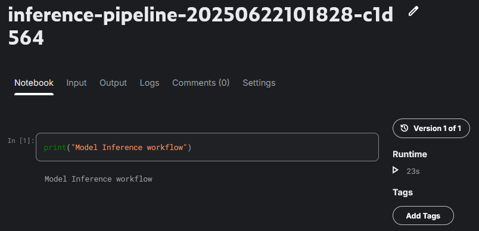

# run_workflow_in_kaggle
---
[](https://github.com/AllieUbisse/run_workflow_in_kaggle/actions/workflows/multi-stage-kaggle-pipeline.yml)


<br>


<br>
[kaggle karnel Overview]: https://python_study_group.gitbooks.io/python/content/kaggle-kernel.html


# Limitations:
  -  This workflow is a work in progress, we main to automate running workloads in Kaggle resources.
  -  Kaggle AUTH: `Setup your Kaggle Account secrets (KAGGLE_USERNAME, KAGGLE_TOKEN), under Github Action secrets`
Kernel push error: Maximum batch CPU session count of 5 reached.

### Github Action run: `single-notebook-kaggle-pipeline.yml`
```
Run for STAGE in $STAGES; do
🔧 Processing stage: preprocessing
📌 Kernel ID: ***/preprocessing-pipeline-20250622095425-6d9329
Kernel version 1 successfully pushed.  Please check progress at https://www.kaggle.com/code/***/preprocessing-pipeline-20250622095425-6d9329
⏳ Kernel status: RUNNING --> ***/preprocessing-pipeline-20250622095425-6d9329 has status "KernelWorkerStatus.RUNNING"
⏳ Kernel status: RUNNING --> ***/preprocessing-pipeline-20250622095425-6d9329 has status "KernelWorkerStatus.RUNNING"
⏳ Kernel status: RUNNING --> ***/preprocessing-pipeline-20250622095425-6d9329 has status "KernelWorkerStatus.RUNNING"
⏳ Kernel status: RUNNING --> ***/preprocessing-pipeline-20250622095425-6d9329 has status "KernelWorkerStatus.RUNNING"
⏳ Kernel status: COMPLETE --> ***/preprocessing-pipeline-20250622095425-6d9329 has status "KernelWorkerStatus.COMPLETE"
```

### Github Action run:  `multi-stage-kaggle-pipeline.yml`
```
Run for STAGE in $STAGES; do
🔧 Processing stage: train
📌 Kernel ID: ***/train-pipeline-20250622101828-c1d564
Kernel version 1 successfully pushed.  Please check progress at https://www.kaggle.com/code/***/train-pipeline-20250622101828-c1d564
⏳ Kernel status: QUEUED --> ***/train-pipeline-20250622101828-c1d564 has status "KernelWorkerStatus.QUEUED"
⏳ Kernel status: RUNNING --> ***/train-pipeline-20250622101828-c1d564 has status "KernelWorkerStatus.RUNNING"
⏳ Kernel status: RUNNING --> ***/train-pipeline-20250622101828-c1d564 has status "KernelWorkerStatus.RUNNING"
⏳ Kernel status: RUNNING --> ***/train-pipeline-20250622101828-c1d564 has status "KernelWorkerStatus.RUNNING"
⏳ Kernel status: RUNNING --> ***/train-pipeline-20250622101828-c1d564 has status "KernelWorkerStatus.RUNNING"
⏳ Kernel status: COMPLETE --> ***/train-pipeline-20250622101828-c1d564 has status "KernelWorkerStatus.COMPLETE"
🔧 Processing stage: validation
📌 Kernel ID: ***/validation-pipeline-20250622101828-c1d564
Kernel version 1 successfully pushed.  Please check progress at https://www.kaggle.com/code/***/validation-pipeline-20250622101828-c1d564
⏳ Kernel status: RUNNING --> ***/validation-pipeline-20250622101828-c1d564 has status "KernelWorkerStatus.RUNNING"
⏳ Kernel status: RUNNING --> ***/validation-pipeline-20250622101828-c1d564 has status "KernelWorkerStatus.RUNNING"
⏳ Kernel status: RUNNING --> ***/validation-pipeline-20250622101828-c1d564 has status "KernelWorkerStatus.RUNNING"
⏳ Kernel status: RUNNING --> ***/validation-pipeline-20250622101828-c1d564 has status "KernelWorkerStatus.RUNNING"
⏳ Kernel status: RUNNING --> ***/validation-pipeline-20250622101828-c1d564 has status "KernelWorkerStatus.RUNNING"
⏳ Kernel status: COMPLETE --> ***/validation-pipeline-20250622101828-c1d564 has status "KernelWorkerStatus.COMPLETE"
🔧 Processing stage: inference
📌 Kernel ID: ***/inference-pipeline-20250622101828-c1d564
Kernel version 1 successfully pushed.  Please check progress at https://www.kaggle.com/code/***/inference-pipeline-20250622101828-c1d564
⏳ Kernel status: QUEUED --> ***/inference-pipeline-20250622101828-c1d564 has status "KernelWorkerStatus.RUNNING"
⏳ Kernel status: RUNNING --> ***/inference-pipeline-20250622101828-c1d564 has status "KernelWorkerStatus.RUNNING"
⏳ Kernel status: RUNNING --> ***/inference-pipeline-20250622101828-c1d564 has status "KernelWorkerStatus.RUNNING"
⏳ Kernel status: RUNNING --> ***/inference-pipeline-20250622101828-c1d564 has status "KernelWorkerStatus.RUNNING"
⏳ Kernel status: RUNNING --> ***/inference-pipeline-20250622101828-c1d564 has status "KernelWorkerStatus.RUNNING"
⏳ Kernel status: RUNNING --> ***/inference-pipeline-20250622101828-c1d564 has status "KernelWorkerStatus.RUNNING"
⏳ Kernel status: COMPLETE --> ***/inference-pipeline-20250622101828-c1d564 has status "KernelWorkerStatus.COMPLETE"
```

